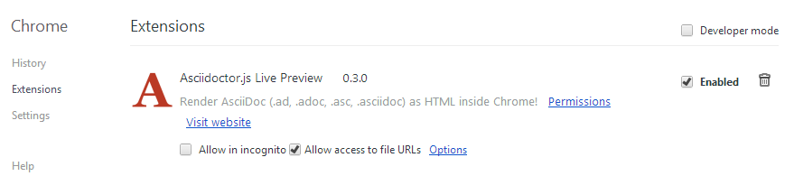

|=======================
|link:index.adoc[Home]|link:EditorSetupForAsciiDoc.adoc[Editor Setup]|link:Ruby.adoc[Ruby Setup]|link:BuildingAsciidoctorJS.adoc[Building Asciidoctor.js]|link:TestAsciiDoc.adoc[Test Page]
|=======================

= Editor Setup for Writing AsciiDoc

This explains how to use a text editor and web browser to write and preview AsciiDoc text documents.

== Add syntax highlighter to Notepad++

Download the userDefineLang.xml from here:
https://github.com/edusantana/asciidoc-highlight

Place in your directory
 
 C:\Users\tbergeron\AppData\Roaming\Notepad++

To use, open a text doc with AsciiDoc extension. .adoc, .asc, .asciidoc, .ad

e.g. *example.adoc*. 

=== Troubleshooting Notepad++

.If you already have a userDefineLang.xml file
IMPORTANT: If you have multiple user defined languages, you can renamed the file: userDefineLang_AsciiDoc.xml 
_

.In Notepad++ 
* Language > Define you own language 

------
Ted was able to setup syntax-highlighting for Markdown and AsciiDoc here. However Ben only has 
Language > User Defined and was unable to allow multiple languages. Ted thinks "User Defined" means it will look at the file named userDefineLang.xml
------

=== Other Editors

.Sublime Text
There is an AsciiDoc syntax highlighter for Sublime Text also. But it only works with some of the themes.

.Brackets
icon:star[role=yellow] The Brackets.io editor has a new AsciiDocs preview plugin (5/16/2014) *BEST* because now supports syntax highlighting and admonition icons and themes.

.Atom
https://atom.io/ A hackable text editor for the 21st Century (currently for Mac OSX 10.8 as of 5/19/2014) Now has a side-by-side AsciiDoc preview https://twitter.com/mojavelinux/status/467961746171629568/photo/1

.AsciidocFX
https://github.com/rahmanusta/AsciidocFX A side-by-side editor for Windows and Linux. Does not have syntax highlighting or admonition icons. (5/29/2014)

.Online Editor
icon:star[role=yellow] (5/28/2014) online sandbox was launched: http://espadrine.github.io/LivesciiDoc/ . works the same as ours, but has the syntax highlighting, so I think we should borrow that from his source: https://github.com/espadrine/LivesciiDoc/

Check out this online editor http://wildfly-mgreau.rhcloud.com/ad-editor/ Uses Java and Asciidoctor

== Add Chrome browser extension

* Get more extensions
https://chrome.google.com/webstore/category/extensions?hl=en-US
* Search for asciidoc
* Install *Asciidoctor.js Live Preview*

=== Adjust settings

* In Chrome, go to: Settings > Extensions > Asciidoctor.js Live Preview 
* Check to allow access to file URLs.

* Browse to your text file

 file:///C:/Users/tbergeron/Desktop/AsciiDocSetup.adoc
 
* File must have an AsciiDoc extension: .adoc, .asc, .asciidoc, .ad

TIP: Try out the various themes such as *riak* or *readthedocs* theme in the Asciidoctor.js Live Preview > Options

== Start Writing

Quick Ref: http://asciidoctor.org/docs/asciidoc-syntax-quick-reference/

AsciiDoc Cheat Sheet: http://powerman.name/doc/asciidoc

NOTE: The AsciiDoctor.js file is *almost complete* which means it may not fully render every little thing. If you run into a discrepancy, use this formatting guide: http://asciidoctor.org/docs/asciidoc-writers-guide/

Official home of AsciiDoc: http://asciidoc.org/

== Where else is AsciiDoc rendered?

The easiest way to experiment with AsciiDoc is online. AsciiDoc document in a GitHub repository or a gist is automatically rendered as HTML and displayed in the web interface.

If you have a project on GitHub, you can write the README or any other documentation in AsciiDoc and the GitHub interface will show the HTML output for visitors to view.

Gists, in particular, are a great way to experiment with AsciiDoc. Just create a new gist, name the file with the extension .adoc and enter AsciiDoc markup. You can save the document as public or secret. If you want to try AsciiDoc without installing any software, a gist is a great way to get started.

While there’s plenty more of the AsciiDoc syntax and toolchain to explore, you know more than enough about it to write a range of documentation, from a simple README to a comprehensive user guide.

http://themes.asciidoctor.org/preview/#what-else-can-asciidoc-do[cite (has themes you can switch)]

